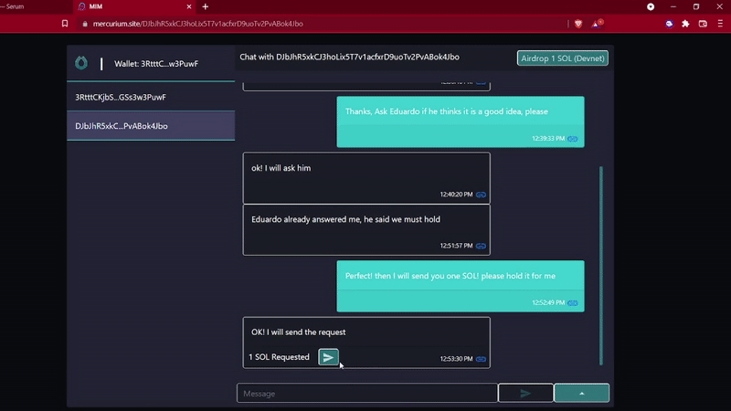

  

# Mercurium Instant Messenger

Welcome to MIM.

###  Mercurium is an instant messenger built on the Solana blockchain and integrated into the Serum UI. The Dapp is fully on-chain, and allows for SOL transfer.

This is our submission for the Convergence Hackathon 2022.

#### Click here to watch our demo video:

## To test the product follow this link:
<a href="https://www.nft-arcade.online/" target="_blank" style="font-size:30px;">
https://main.d3lic6l5z1fp8z.amplifyapp.com

### Use Solana devnet on the Phantom wallet!!!!
    
Get it on: https://phantom.app/

Follow: https://hello-17.gitbook.io/crema-devnet-test-guide/switch-your-solana-wallet-to-devnet
    
More Help: https://github.com/altaga/Mercurium-Instant-Messenger#our-solution

Needless to say, you need a friend to test it or you could message us via Devpost.    
    
</a>

# Introduction and Problem Statement:

When we were researching what to hack we decided to check what kind of projects did the Serum and Solana communities had or what kind of Dapps they wanted the community to develop. 

So, we found this under project Requests and grants:

Quite interesting that there was an important demand for this kind of messaging applications, when they are ubiquitous nowadays.

But we had to evaluate first the market and see if there is really a problem...

Messaging systems and apps such as whatsapp, telegram, wechat, facebook messenger and so many others have become ubiquitous nowadays. And not only that, but businesses and individuals have become partially dependent on these and we trust them because of the number of people that use them. With more than 3.6 billion people worldwide and over 145 billion messages being sent every day. 

This has brought forth stratospheric market valuations.

WhatsApp was acquired for $19 billion in 2014, Telegram has over 500 million users and rejected an investment offer at $30 billion. Skype was sold to Microsoft for $8.5 billion in 2011. And they will continue growing at a rate of 10% per year by 2030.

But there's a huge privacy problem in regards to siloed enterprises controlling data. These are regarding several right’s violations mainly around privacy such as Data sharing violations like the fine of 266 million euros that Whattsapp received by the EU in September last year, Telegram’s constant issues with cyber theft mainly around bank accounts and quite a large number of cases of Blackmail. And private data leaks such as the one that happened through facebook in April 2021.

Nevertheless, messaging companies are still operating under practices that suggest data governance has not been solved.

We indeed have a problem!

Data is the most valuable resource an individual has and through blockchain technology this privacy issue can be quenched. We think that the way to launch a competitor is through the DeFi ecosystem as it is growing at an incredible rate and Serum is one of the premium platforms for that.

Having said that we decided to build it with the following characteristics:

- Fully on-chain encrypted chat app, 
- Directly integrated to Serum GUI.
- With a great UI.
- Allows SOL transfer between chatters!

# Our Solution:

A Fully on-chain instant messenger was developed in Solana, making interactions through our [Phantom Wallet](https://phantom.app/) and integrated to Serum DEX.

Once the address bar is open, put your contact's address to which we will send messages and press StartChat.

Once the new tab is open, we can start sending messages to the corresponding address. 

In addition to that we provide a service request or send SOL to the other address in a simple way.

Request:

Send:

And as mentioned before, only transactions that have been made by signing with our Phantom Wallet are authorized.

All this demo runs on the devnet network, in order to be able to carry out the corresponding tests. For testing purposes we deactivated encryption and added an Airdrop button. If you do not have SOL to test on Devnet to check out our platform, you can press it as many times as you want.

# How it's built:

All our chat is based on the use of transactions and interaction with a memo program deployed on the solana blockchain (devnet), using the Solana JS SDK for interactions from the frontend and the Phantom Wallet to sign the transactions, in addition to everything be made using the ReactJS framework.

First of all, we deploy our own memo program, through the Solana CLI.

[Pogram Code](./Program)

If you want to rebuild the program you will occupy the following dependencies on your computer.

- [NodeJS.](https://nodejs.org/en/) 
- [Solana CLI.](https://docs.solana.com/cli/install-solana-cli-tools)
- [Rust.](https://www.rust-lang.org/)

You can use our program as well as it is deploying on the blockchain.

[Solana Explorer Program](https://explorer.solana.com/address/DVzMcYDk2Hs2BF5P5iHEDc3ZG7wpLHRG9WaQPCjfayug?cluster=devnet)

All the chat is completely on-chain, so all the data obtained is through the Solana JS SDK, so in order to track transactions and messages, two instructions were used in each transaction.

## Instruction 1: 

Add the message to the transaction and upload it to the blockchain.

    const instruction = new solanaWeb3.TransactionInstruction({
            keys: [],
            programId: memoPublicKey,
            data: Buffer.from(tempMessage),
    });

## Instruction 2: 

Send a transaction with 0 or more Solana in it, this instruction helps us to have the from and to information for the chat.

    var transaction = new solanaWeb3.Transaction().add(
    instruction,
    solanaWeb3.SystemProgram.transfer({
        fromPubkey: this.provider.publicKey,
        toPubkey: new solanaWeb3.PublicKey(to),
        lamports: this.state.req ? 0 : Math.round(solanaWeb3.LAMPORTS_PER_SOL * num) //Investing 1 SOL. Remember 1 Lamport = 10^-9 SOL.
    })
    );

## Example:

Here is the example of a transaction directly from the Blockchain.

[Solana Explorer Transaction](https://explorer.solana.com/tx/3S5FGp32xsQDCEc8sXxxxwrwJxnNQBFpfQrqRKZAqAFJc7TawxQn1KRxbTZE8aMzCeJZb9Zmge39ww92hagHT2Kc?cluster=devnet)

# What's next:

We will be working to improve on this Prototype, we already have the main characteristics of an instant messenger and it works seamlessly within Serum, but we need a couple more features. Regarding encryption, it is very easy to do and we could have done it at this time, we coded it and it is ready for deployment, but we opted to not include it in this version to help testers prove it is indeed On-chain which is the most difficult feature to have. 

Other features we will be looking at from here on are:

- Token(Serum) and NFT transfer.
- Audio, video, documents, audio notes and multimedia in general. (Perhaps an integration with Arweave for that?)
- Push Notifications
- Online Status
- Mobile Version

Data is the ultimate resource for the coming years and in an age where we have incredible machine learning and cryptographic technologies, not to mention blockchain it is a shame that we have to rely on big tech for an application that has to become a human right. Of course, privacy is paramount and when we are dealing with a use case for money, which DeFi is, it is of utmost importance.

Hopefully you liked the project and please support it. 

# Team

# References:

https://www.buzzfeednews.com/article/charliewarzel/why-facebook-bought-whatsapp
https://www.aljazeera.com/economy/2021/9/2/whatsapp-fined-266m-by-eu-privacy-watchdog-over-data-breach
https://www.forbes.com/sites/zakdoffman/2021/04/22/forget-whatsapp-new-telegram-warning-for-millions-of-windows-10-users/?sh=3c609d8d7857
https://www.independent.co.uk/life-style/gadgets-and-tech/news/north-korea-telegram-cryptocurrency-bitcoin-lazarus-hackers-kaspersky-a9277956.html
https://www.businessinsider.com/stolen-data-of-533-million-facebook-users-leaked-online-2021-4?r=MX&IR=T
https://www.npr.org/2021/04/09/986005820/after-data-breach-exposes-530-million-facebook-says-it-will-not-notify-users
