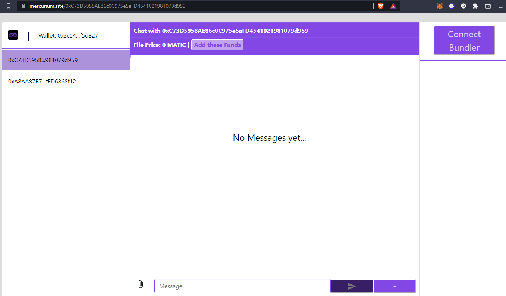
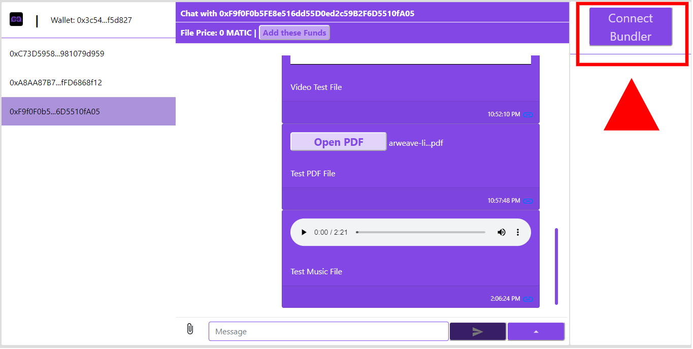

### This is our submission for the
### 
 Arweave <> Polygon Hackathon 2022.

## https://arweave-polygon.devpost.com/

# Mercurium Instant Messenger
  

## Welcome to MIM.

Mercurium is an instant messenger built on the Polygon Mainnet. It has file transfer integrated with bundlr.network,  a multi-chain layer 2 solution for Arweave. 

The Dapp is fully on-chain, allows Matic and File transfer.

Click to open PolygonScan

# Watch our demo video:

# Test the product:

### https://www.mercurium.site/ 

- Instructions here: https://github.com/altaga/Mercurium-Instant-Messenger#our-solution

### Use Polygon Mainnet on Metamask Wallet!!!!
    
- Get it on: https://metamask.io/

- Follow: https://docs.polygon.technology/docs/develop/metamask/config-polygon-on-metamask/

Needless to say, you need a friend to test, two browsers with 2 Polygon Address or you could message us via Devpost.    

# Introduction and Problem Statement:

Messaging systems and apps such as whatsapp, telegram, wechat, facebook messenger and so many others have become ubiquitous nowadays. And not only that, but businesses and individuals have become partially dependent on these and we trust them because of the number of people that use them. With more than 3.6 billion people worldwide and over 145 billion messages being sent every day. 

This has brought forth stratospheric market valuations.

WhatsApp was acquired for $19 billion in 2014, Telegram has over 500 million users and rejected an investment offer at $30 billion. Skype was sold to Microsoft for $8.5 billion in 2011. And they will continue growing at a rate of 10% per year by 2030.

But there's a huge privacy problem in regards to siloed enterprises controlling data. These are regarding several right’s violations mainly around privacy such as Data sharing violations like the fine of 266 million euros that Whattsapp received by the EU in September last year, Telegram’s constant issues with cyber theft mainly around bank accounts and quite a large number of cases of Blackmail. And private data leaks such as the one that happened through facebook in April 2021.

Nevertheless, messaging companies are still operating under practices that suggest data governance has not been solved.

Data is the most valuable resource an individual has and through blockchain technology this privacy issue can be quenched. We think that the way to launch a competitor is through the DeFi ecosystem as it is growing at an incredible rate and Serum is one of the premium platforms for that.

Having said that we decided to build it with the following characteristics:

 - Fully on-chain encrypted chat app,
 - Directly integrated with Polygon scan and built on Polygon.
 - Moralis managing everything from the backend for a faster implementation.
 - Will allow MATIC and MATIC-based token transfer between chatters!
 - And everything will be stored on Arweave through Bundlr.network.

# Our Solution:

A Fully on-chain instant messenger was developed in [Solidity](https://docs.soliditylang.org/en/v0.8.12/), deployed on the [Polygon](https://polygon.technology/) mainnet, making interactions through [Metamask Wallet](https://metamask.io/) and integrating file transfer with [bundlr.network](https://bundlr.network/).

### System's Architecture:

### Walkthorugh:

- Open the application with the following link:

<a href="https://www.mercurium.site/" target="_blank" style="font-size:30px;">
https://www.mercurium.site/ 
</a>

- On the address bar, input the contact address to which we will send messages and press StartChat.

- Sign in with your account (sign in provided by Moralis).

- Once the app is open, we can start sending messages to the corresponding address. 

- The most important thing is the possibility of sending files in a decentralized way thanks to bundlr.network. First press the Connect Bundler button.

- Press the Sign button to login to the Bundlr service (This activates WebBundlr).

- Once the session has started, your balance will appear in bundle.network, we will have a button to add funds to your account and the list of files that we have sent in each conversation will appear.

- To send a file we will have to load the file first in the browser, pressing the clip icon next to the message bar.

- Once you open the file upload menu, select the file and open.

- Once the file is uploaded, the icon will turn green, we can also see the cost of sending it. In the case of not having the balance for it, we can optionally add only the cost of the file to our account with the Add these Funds button.

NOTE: IT WILL ALWAYS BE MORE ECONOMICAL TO ADD BALANCE FROM THE ADD FUNDS BUTTON FOR THE GAS FEES OF THE MATIC AND BUNDLR NETWORK.

- With everything ready, we can write our message and send our file by pressing the Send icon. The first signature will be from your file uploaded to bundlr.network.

- The second signature will be to send our message in the chat.

- Finally we will have to wait a few seconds for the message to be read from the contract and appear in our chat window.

- Files that can be opened or played directly in chat are:

  - Videos:
  
  - Images:
  
  - Audio:
  

- In addition to that you can request or send Matic to the other address in a simple way.

- All this demo runs on the Polygon Mainnet, Matic network fees are very low allowing a great number of messages and transactions at a low cost.

# How it's built:

Our chat is based on the use of transactions and interaction with a smart contract, developed in [Solidity](https://docs.soliditylang.org/en/v0.8.12/), deployed on the [Polygon](https://polygon.technology/) blockchain (mainnet), using the [Moralis](https://moralis.io/) JS SDK for interactions from the frontend, the [Metamask Wallet](https://metamask.io/) to sign all the transactions and integrated file transfer with [bundlr.network](https://bundlr.network/).

First of all, we deployed our own smart contract, through the Remix IDE.

- Remix Link: https://remix.ethereum.org/

- Contract Polygon Scan: https://polygonscan.com/address/0xf4abfb397d67babcaf7c3cc2edcf0d041be32c38

- Code: 
https://github.com/altaga/Mercurium-Instant-Messenger/blob/main/Contract/Chat.sol

All the chat is completely on-chain, so all the data obtained is through the Moralis JS SDK, so in order to track transactions and messages.

## Tech we use

## Polygon

Polygon is used for almost everything, we sign every single message (as they are all on-chain) with Metamask through the mainnet RPC and the MATIC transactions are done, well, through it also.

Here is the UI and how you can chat, send files, and also send and request MATIC tokens.

## Arweave:

Bundlr Network and Arweave L2, are used to send the files in a decentralized way in order to make a completely on-chain chat.

Bundlr Setup:

    let providerName = "MetaMask";
    let currencyName = "matic"
    const providerFunc = providerMap[providerName] // get provider entry
    const currency = currencyMap[currencyName] // get currency entry
    const provider = await providerFunc(currency); // 
    const bundlr = new WebBundlr(bundlrNode, "matic", provider);
    await bundlr.ready();
    return bundlr; // done!

Bundlr Upload File and add to message:

    let response = await this.bundlr.uploader.upload(this.state.fileBuffer, this.state.file)
    tempMessage += `:file:https://arweave.net/${response.data.id}/${this.state.file.name}:filef:`

NOTE: This way of adding information to a message is based on how Discord adds items to your chat.

## Moralis

We use Moralis for almost everything on the backend, from managing the Polygon RPC to interactions from the frontend and the Metamask Wallet to sign the transactions. 

    await this.Moralis.start({ serverUrl, appId });
        let user = this.Moralis.User.current();
        if (user ? false : true) {
            try {
            user = await this.Moralis.authenticate({ signingMessage: "Log in using Moralis" })
            console.log("Ok authentication");
            }
            catch (e) {
            console.log("Cancel authentication");
            window.open(`/`, "_self");
            }
        }
        if (user ? false : true) {
            console.log("User Rejected");
        }

# Example transaction:

Here is the example of a transaction directly from the Blockchain.

[Polygon Scan Transaction](https://polygonscan.com/tx/0xf7ecccbebb7a10a0b6c8229ae84414186fbe47f5bb2d77f046a67c82e99dc547)

# What's next:

We will be working to improve on this Prototype, we already have the main characteristics of an instant messenger and it works seamlessly, but we need a couple more features. 

Other features we will be looking at from here on are:

- NFT transfer.
- Push Notifications
- Online Status
- Mobile Version

Data is the ultimate resource for the coming years and in an age where we have incredible machine learning and cryptographic technologies, not to mention blockchain it is a shame that we have to rely on big tech for an application that has to become a human right. Of course, privacy is paramount and when we are dealing with a use case for money, which DeFi is, it is of utmost importance.

Hopefully you liked the project and please support it. 

# Team

# References:

https://www.buzzfeednews.com/article/charliewarzel/why-facebook-bought-whatsapp
https://www.aljazeera.com/economy/2021/9/2/whatsapp-fined-266m-by-eu-privacy-watchdog-over-data-breach
https://www.forbes.com/sites/zakdoffman/2021/04/22/forget-whatsapp-new-telegram-warning-for-millions-of-windows-10-users/?sh=3c609d8d7857
https://www.independent.co.uk/life-style/gadgets-and-tech/news/north-korea-telegram-cryptocurrency-bitcoin-lazarus-hackers-kaspersky-a9277956.html
https://www.businessinsider.com/stolen-data-of-533-million-facebook-users-leaked-online-2021-4?r=MX&IR=T
https://www.npr.org/2021/04/09/986005820/after-data-breach-exposes-530-million-facebook-says-it-will-not-notify-users
